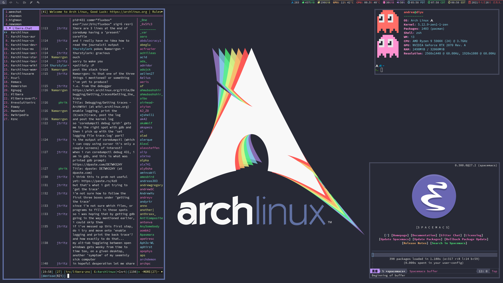
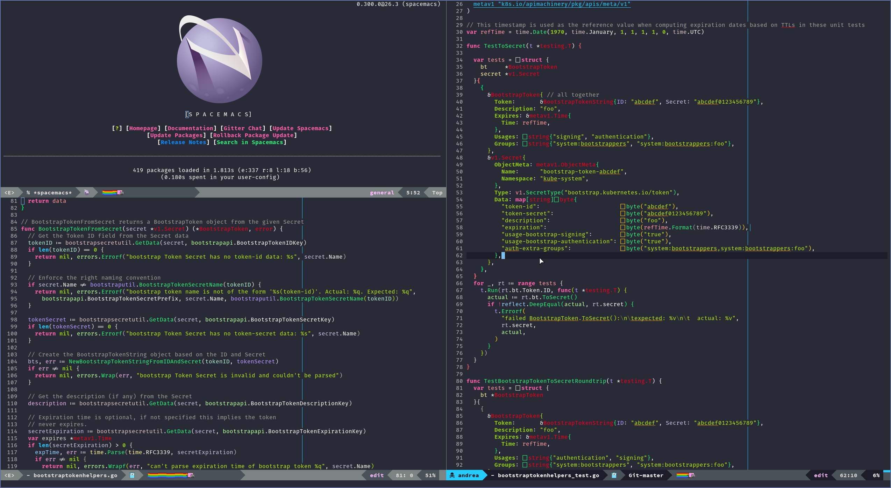

<div align="center">

### Arch Linux [i3-gaps + i3blocks + Zsh + Spacemacs + Rofi + Neofetch]



```
       __      __  _____ __
  ____/ /___  / /_/ __(_) /__  _____
 / __  / __ \/ __/ /_/ / / _ \/ ___/
/ /_/ / /_/ / /_/ __/ / /  __(__  )
\__,_/\____/\__/_/ /_/_/\___/____/
             __
            / /_  __  __
           / __ \/ / / /
          / /_/ / /_/ /
         /_.___/\__, /
               /____/
                   __
  ____ _____  ____/ /_______  ____ _
 / __ `/ __ \/ __  / ___/ _ \/ __ `/
/ /_/ / / / / /_/ / /  /  __/ /_/ /
\__,_/_/ /_/\__,_/_/   \___/\__,_/
```


</div>

------
### Welcome to my dotfiles! :space_invader:

I was struggling to find a Zsh theme and that had what I was looking for so I made my own theme using Powerlevel9k!

I then wrote my i3-gaps and i3blocks configs to look gorgeous and to make my workflow smoother.

I'm including some screenshots on this repo and a list of dependencies in case you want to clone/fork my config :wink:

**For the Shell:**

| Package                                                  | Description                                                      |
|----------------------------------------------------------|------------------------------------------------------------------|
| [Arch Linux](https://www.archlinux.org/)                 | The best distro ever!                                            |
| [Zsh](https://github.com/zsh-users/zsh)                  | The most powerful shell out there!                               |
| [Powerlevel9k](https://github.com/bhilburn/powerlevel9k) | The most awesome Powerline theme for ZSH around!                 |
| acpi                                                     | To monitor the battery status                                    |
| [neofetch](https://github.com/dylanaraps/neofetch)       | A fast, highly customizable system info script                   |
| [Nerd Fonts](https://github.com/ryanoasis/nerd-fonts)    | Fonts patched with lots of amazing icons (I use Source Code Pro) |

------

**For the window manager:**

| Package                                                                   | Description                                                                       |
|---------------------------------------------------------------------------|-----------------------------------------------------------------------------------|
| [i3-gaps](https://github.com/Airblader/i3)                                | i3wm with more features                                                           |
| [i3blocks](https://github.com/vivien/i3blocks)                            | A replacement for the default i3status with more features                         |
| [Nerd Fonts](https://github.com/ryanoasis/nerd-fonts)                     | Fonts patched with lots of amazing icons (I use Source Code Pro)                  |
| [Rofi](https://github.com/DaveDavenport/rofi)                             | A window switcher, application launcher and dmenu replacement                     |
| [Compton](https://github.com/chjj/compton)                                | A compositor for X, to get window transparency and avoid tearing and vsync issues |
| [Playerctl](https://github.com/acrisci/playerctl)                         | To display current song on i3blocks                                               |
| [Feh](https://github.com/derf/feh)                                        | Image viewer, useful to set a wallpaper                                           |
| xfce4-power-manager                                                       | Simple way to monitor battery status                                              |
| xfce4-notifyd                                                             | Helpful to get GTK notifications like current song or battery status              |
| [pacman-contrib](https://www.archlinux.org/packages/?name=pacman-contrib) | Contributed scripts and tools for pacman systems                                  |

------

### I :sparkling_heart: i3 tiling capabilities:

---
### Zsh is the best:

---
### My [Rofi](https://github.com/DaveDavenport/rofi) theme:

---
### [Spacemacs](https://github.com/syl20bnr/spacemacs) rules!
###### The best editor is neither Emacs nor Vim, it's Emacs *and* Vim!

---
<div align="center">

# Made with :sparkling_heart: by yours truly.

</div>
